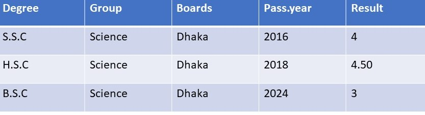

# CV

<html>
<head>

</head>
<body>

<ul>
  <li><a class="active" href="#home">Home</a></li>
  <li><a href="#news">News</a></li>
  <li><a href="#contact">Contact</a></li>
  <li><a href="#about">About</a></li>
</ul>

 
 <h1> CURRICULUM VITAE</h1>

 

  
Name					            :Md kamal Hossian

  
Father’s Name				    :Md Aslam Khan    

  
Mother’s Name			    	:Mst taslima khatun

  
Permanent Address	    	:Village-Rohimpur,
                              Post-Islampur,Thana-Bogora,District-Bogora

  
Mobile No				        :1234567890

  
Date of Birth			    	:24/03/2000

  
Sex					            :Male

  
Religion			         	  :Islam

  
Nationality			      	:Bangladeshi

  
Educational Qualification:    
      
              
    
    
  
  
Experience              :I have two years work experience in private job sector.

</body>
</html>
